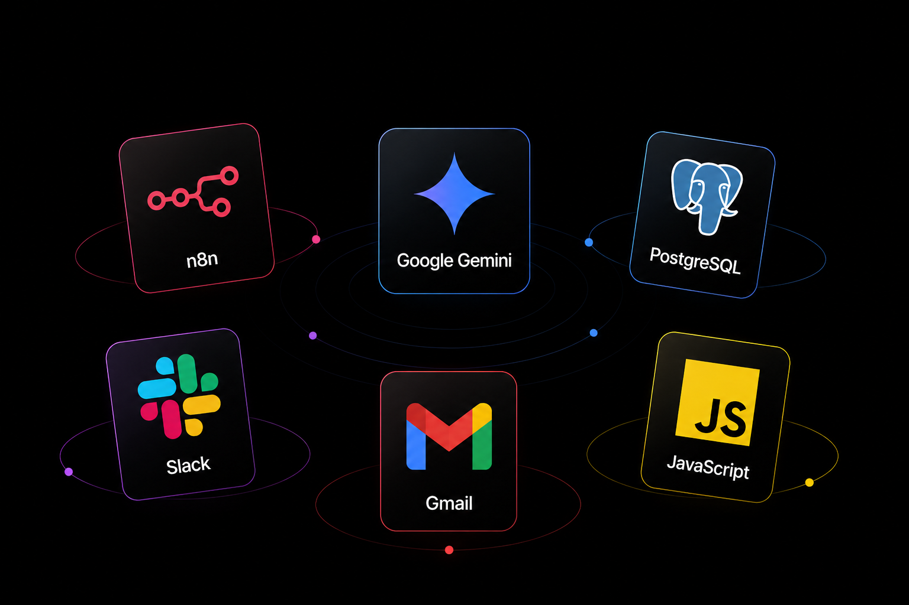

<h1 align="center">
  
  Support Nexus
</h1>

<p align="center">
  <strong>AI-Powered Customer Support Automation Platform</strong>
</p>

<p align="center">
  
  
  
  
  
  
  
</p>

---

# 📖 Overview

**Support Nexus** is an **AI-powered Customer Support Automation Platform** developed as my **Capstone Project** during my internship at **IIT Jammu**.

The platform automates the complete customer support lifecycle—from ticket submission and AI-powered classification to SLA monitoring, customer notifications, feedback collection, and daily analytics.

Built using **n8n**, **Google Gemini**, **PostgreSQL**, **Slack**, **Gmail**, and **JavaScript**, the project demonstrates how workflow automation and AI can streamline real-world customer support operations.

---

# ✨ Key Features

- 🤖 AI-powered Ticket Classification
- 🎫 Automatic Ticket Registration
- ⚡ Priority & Department Assignment
- 👨‍💻 Intelligent Agent Assignment
- ⏰ SLA Deadline Monitoring
- 💬 Slack Integration
- 📧 Automated Gmail Notifications
- ⭐ Customer Feedback Collection
- 📊 Daily Digest & Analytics
- 🗄 PostgreSQL Centralized Database

---

# 🏗 System Architecture

<p align="center">

</p>

---

# ⚙️ Technology Stack

<p align="center">

</p>
---

# 🔄 Complete Workflow

The entire automation is implemented through **6 interconnected workflows** inside n8n.

### Workflow Modules

- Ticket Intake & AI Classification
- My Tickets (Slack)
- SLA Monitoring
- Ticket Resolution
- Customer Feedback Collection
- Daily Digest & Analytics

---

# 📸 Workflow Preview

<p align="center">

</p>

---

# 📊 Project Highlights

| Feature | Status |
|---------|:------:|
| AI Ticket Classification | ✅ |
| Slack Integration | ✅ |
| Gmail Notifications | ✅ |
| PostgreSQL Database | ✅ |
| SLA Monitoring | ✅ |
| Feedback Collection | ✅ |
| Daily Analytics | ✅ |
| Fully Automated Workflow | ✅ |

---

# 📂 Repository Structure

```text
# 📂 Repository Structure

```text
Support-Nexus/
│
├── 📁 assets/
│   ├── banner.png
│   ├── logo.png
│   ├── architecture.png
│   ├── tech-stack.png
│   ├── workflow.png
│   ├── demo.mp4
│   └── ... (other project assets)
│
├── 📄 Support Nexus.json
│
├── 📄 docker-compose.yml
│
├── 📄 README.md
│
└── 📄 LICENSE
```

---

# 🚀 Getting Started

### Clone the Repository

```bash
git clone https://github.com/akshatbindal-075/Support-Nexus.git
```

```bash
cd Support-Nexus
```

---

### Import Workflows

Import the workflow JSON file into your n8n instance.

Configure the required credentials:

- Google Gemini API
- PostgreSQL
- Gmail
- Slack

Run the workflows.

---

# 🎥 Demo

🎬 **Project Demonstration**

👉 [Click here to watch the demo](./assets/demo.mp4)

---

# 🌱 Future Scope

- Customer Support Dashboard
- WhatsApp Integration
- Microsoft Teams Integration
- Knowledge Base Search
- AI Response Suggestions
- Ticket Summarization
- Multi-language Support
- Performance Dashboard

---

# 👨‍💻 Developed By

## Akshat Bindal

**B.Tech Artificial Intelligence & Machine Learning**

Capstone Project • IIT Jammu Internship

---

# ⭐ Show Your Support

If you found this project helpful or interesting,

**⭐ Please consider giving the repository a star!**

It motivates me to continue building and sharing more AI & Automation projects.

---

<p align="center">

### 🚀 Building Smarter Customer Support with AI

</p>
